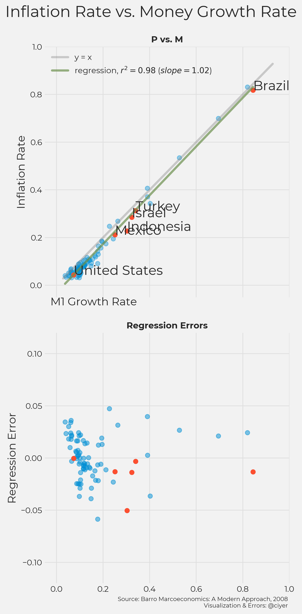
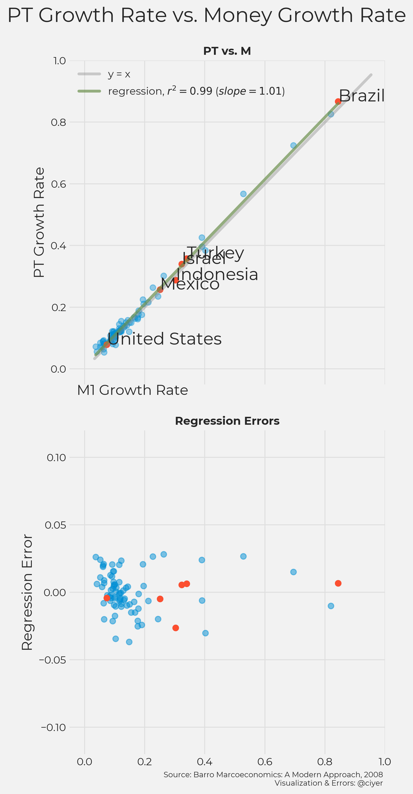
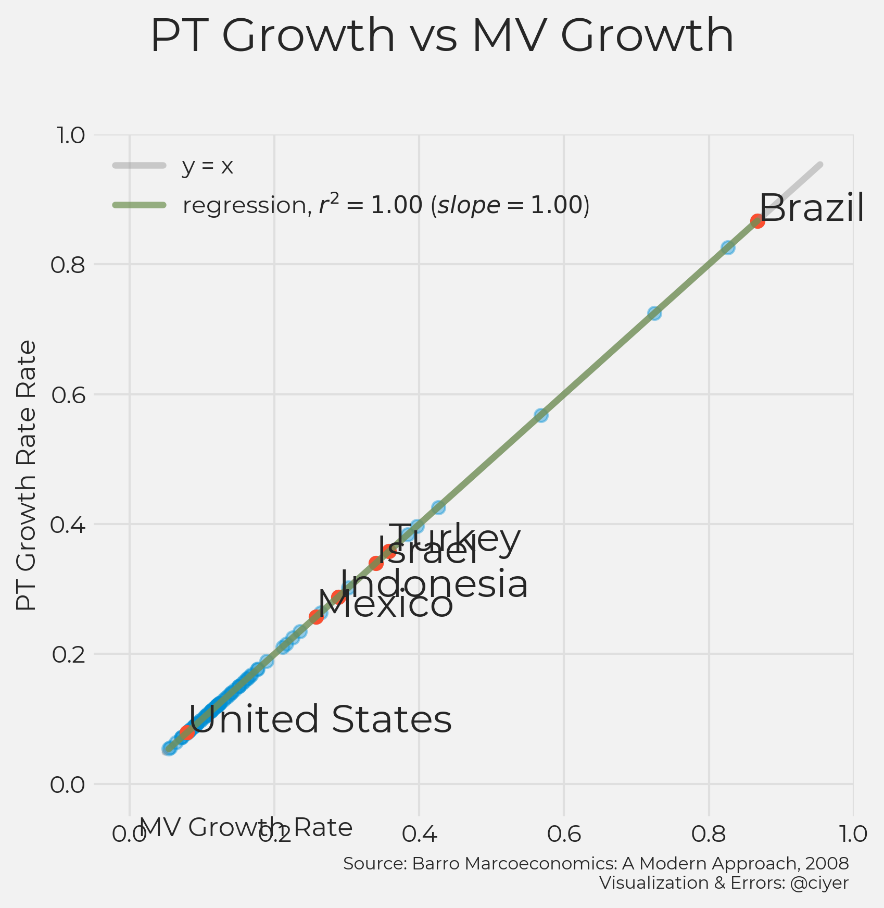

# The Quantity Theory of Money Insanity (Part 1)

*QTM and Inflation in the Long Run*

It is certainly possible to live in modern society without money at all, but it does require some commitment (see https://zerocurrency.blogspot.com). For those of us who accept money as part of daily life, a recurring question is what does one nominal unit of currency (be it dollar, euro, peso, rupee, yen, etc.) buy today? How is that different from yesterday and how will that be different tomorrow? And why does it change? In other words, “why is there inflation?”

Popular accounts of inflation often draw on the Quantity Theory of Money (QTM). It is there when you read about William Jennings Bryan and the Cross of Gold speech; you see it when newspaper columnists write about how the central bank is turning on the “printing press” and reducing the value of our money; and nowadays, you see it when Bitcoin enthusiasts tout cryptocurrencies with limited supply as a hedge against inflation. 

But I have always been confused by the disconnect between the acceptance of QTM and the fact that the inflation we actually encounter is explained as “inflation increased last month because the price of fuel went up.”  You never read that “inflation increased last month because the central bank printed more money.”

I assumed that this disconnect arises from the difference between the casual language of everyday and the more precise language of quantitative economics. But after looking into the data in greater detail, I am now skeptical.

The purpose of this three-part series is to view QTM from the perspective of data.

Explanations of QTM generally contain three components: 1. QTM explains inflation in the long run, 2. QTM explains rapid hyperinflation, and 3. QTM implies that increases in the amount of money raise inflation over the medium term. There are theoretical reasons to believe these claims; here we will take a look at how well they are reflected in real-world data.

I am not an economist. In fact, my first exposure to the phrase "quantity theory" came from the author [Will Self](https://twitter.com/wself) and his short story collection [_The Quantity Theory of Insanity_](https://www.powells.com/book/quantity-theory-of-insanity-9780802121462); I think the association is apt. Many objections to the Quantity Theory of Money are obvious, but they are never dealt with when the theory is presented. By looking at the data, I have been convinced that the critics are mostly correct, and maybe you will see why I feel there is some insanity around the discussion of the Quantity Theory of Money.

## The Equation of Exchange

The basis of the theory is the [equation of exchange](https://en.wikipedia.org/wiki/Equation_of_exchange), which states that the nominal GDP can be defined as either the price level (P) * the real GDP (T, sometimes Q); or it can be defined as the amount of money (M) * the velocity of money (V). These quantities vary in time (t), and the two alternate definitions need to always be equal:

$M(t) \times V(t) = P(t) \times T(t)$

It is usually added here that changes to V and T have been historically small because they are constrained by many factors, while changes in P and M are less constrained, and they can be large, even over short time frames.

Imagine we have an economy where I make and sell kombucha for \\$2 a glass and you make and sell avocado toast for \\$2 a plate. If we each start off with \\$2 in the bank, I can buy an avocado toast, you could then buy one or two glasses of kombucha, and our economy could go one like this indefinitely. Up to this point, I follow and everything is copacetic.

What happens if this situation is disrupted by the introduction of more money? A helicopter flies by and drops one additional dollar into each of our laps. QTM claims that increases in price are caused increases in the money supply, so the price level will increase: we both raise our prices to achieve an average of \\$3 per item. This is when a table of data containing the change in the money supply and change in the price level for a large number of countries is trotted out as evidence. And this is when I start to question my sanity.

## The Barro Data Set

The Barro data set is a favorite for illustrating QTM. The data presented here comes from Robert Barro’s book [_Macroeconomics, A Modern Approach](https://scholar.harvard.edu/barro/publications/macroeconomics-modern-approach). For 83 countries, it contains the rate of change in the price level, money supply (Barro uses M0), and real GDP. If we plot the rate of change in money supply vs. the rate of change in the price level, it looks like this: you see a line that fits the data very well.

    

    

Alex Tabarrok (using a similar data set from a different source) presents this as evidence for QTM in the [Marginal Revolution University video on inflation](https://mru.org/courses/principles-economics-macroeconomics/causes-of-inflation). Scott Sumner uses this data set (from a different edition of the textbook) as evidence in his [Short Intro Course on Money](https://www.themoneyillusion.com/money-and-inflation-pt-3-the-quantity-theory-of-money-and-the-great-inflation).  And, of course, Barro refers to this data set in the chapter on money and inflation.

But the data does not provide evidence of QTM! It is just a restatement of the equation of exchange combined with the knowledge that changes in V and T are constrained. Barro himself acknowledges the that the table only shows an association between the quantity of money and the price level, and that it does not clarify the direction of causality. Sumner also points out that the fit is better for higher inflation currencies because other effects are stronger at the lower ranges, which is just another way of saying that V and T are more constrained and cannot change as much as M and P. Indeed, we can use the data to include changes to T in our plot, and plot the rate of change of M against the rate of change of PT, which improves the fit in general, and especially for low-inflation countries.

    

    

We can also factor in V, and we get, as expected, a perfect fit.

    

    

So, what the Barro table illustrates is that V and T do not change as much as M and P. But in no way does it clarify the direction of causality between M and P. This seems obvious to me, and has been pointed out in the past, for example by Joan Robinson in her 1933 paper [The Theory of Money and the Analysis of Output](https://www.jstor.org/stable/2967434). Somehow, though, none of the popular presentations of QTM that I found addresses this point. They just show the table of growth rates of monetary base and price level and continue as if it demonstrates that QTM is true

Fischer Black was also not convinced. In his 1986 paper, [Noise](https://marginalrevolution.com/marginalrevolution/2017/09/fischer-blacks-classic-1986-essay-noise.html), Black writes:

>I believe that monetary policy is almost passive in a country like the U. S. Money goes up when prices go up or when income goes up because demand for money goes up at those times. I have been unable to construct an equilibrium model in which changes in money cause changes in prices or income, but I have had no trouble constructing an equilibrium model in which changes in prices or income cause changes in money.

## Part 2 Preview

So which explanation better fits the data? Do increases in the money supply *cause* increases in the price level? Or is it the other way around? Or perhaps the interaction between these two variables is confounded by other factors. The Barro data set cannot help us resolve these questions &mdash; the time resolution is too coarse &mdash; but another data set may be able to help.

In Part 2, we will use a data set with finer time resolution to look at hyperinflation and see how well QTM performs as an explanation.
