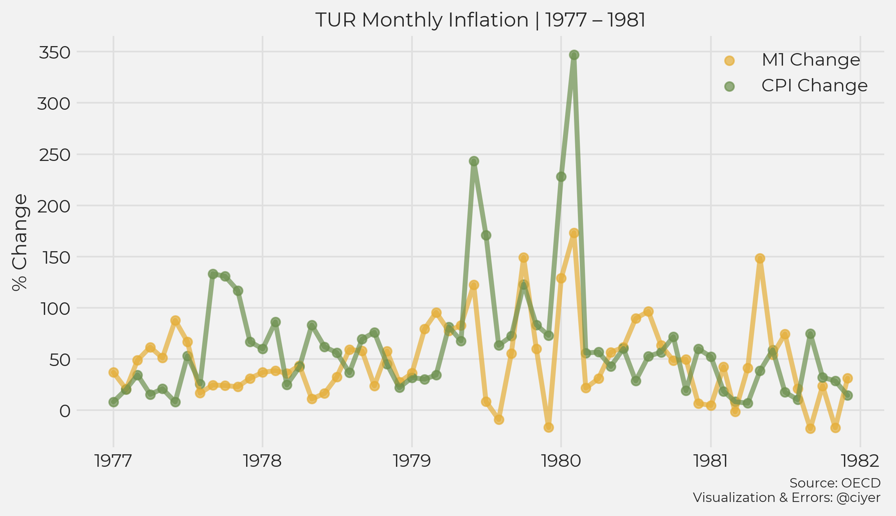

# The Quantity Theory of Money Insanity (Part 2)

*QTM and hyperinflation*

In Part 1, we looked at the Quantity Theory of Money and inflation in the long term. There, we concluded that the Equation of Exchange, along with knowledge about the behavior of changes in velocity and real GDP, are enough to explain inflation in the long term; QTM adds nothing.
Now, we will look at rapid increases in inflation in short periods of time, hyperinflation, and how well QTM explains them.

## The OECD Data Set

OECD [publishes data](https://data.oecd.org) on money supply ([M1](https://data.oecd.org/money/narrow-money-m1.htm) and [M3](https://data.oecd.org/money/broad-money-m3.htm)) and price level ([CPI](https://data.oecd.org/price/inflation-cpi.htm)) for 28 currency areas (27 individual countries + the 19 Euro countries). The OECD data are unfortunately not a perfect  surrogate for the Barro data since there are some major differences: the OECD data are not as uniform and do not provide **M0** as the measure of money, which is what Barro uses.

But despite those shortcomings, the OECD data offer a lot. They are easy to get, easy to work with, and contain money supply and price-level measurements on a monthly time resolution. Let us see if they can give us more detailed insight into  the relationship between inflation and the money supply.

## The Long-term View

Plotting CPI vs M1[1](#fn1) over the entire span of data available for each country, it becomes evident that the fit, though not quite as ideal as in the Barro data set, is still very good, and the slope is quite close to 1. This serves as a sanity check and confirms that the OECD data can be a foundation for understanding QTM: despite the differences  to the Barro data, when viewed over the long term, the OECD data look reasonably similar. (Note: Barro uses continuous growth rates, we use annual here, though this seems to be a minor difference.)

1[M1 was redefined in May 2020](https://www.federalreserve.gov/releases/h6/h6_technical_qa.htm) for the US, making the data harder to understand and interpret. For that reason the US 2020 datapoint is dropped from the plots using annual data, and May 2020 is dropped from plots based on monthly data.

    

    

#### M1 or M3

You often find plots of economic variables using other measures of the money supply (M2 is a favorite). Barro points out that the QTM arguments are most applicable to money as a medium of exchange and M0 or M1 are measures of money in that capacity, and **M2 and M3 are not appropriate measures for that purpose** (_Macroeconomics, A Modern Approach_, Ch 10, p.6 / p.437).

Nonetheless, for comparison, here is a plot of CPI vs. M3. The fit here is also very good (n.b. the M1 and M3 series cover different time spans and the inflation rates for countries are therefore not always equal in the two plots), but the slope is a little further from 1.

Following Barro, for the rest of the article, I use M1, but if you are curious or disagree with this choice, all of my code is available to run. If you wish, you can switch to M3 and rerun the analyses; you will find that the results are basically the same.

    

    

### Country Codes

To save space, I use the three-letter country codes as provided in the OECD data set. For reference, this table can be used to look up the country name.

<table border="1" class="dataframe">
  <thead>
    <tr style="text-align: right;">
      <th></th>
      <th>code</th>
      <th>country</th>
    </tr>
  </thead>
  <tbody>
    <tr>
      <th>0</th>
      <td>AUS</td>
      <td>Australia</td>
    </tr>
    <tr>
      <th>1</th>
      <td>BRA</td>
      <td>Brazil</td>
    </tr>
    <tr>
      <th>2</th>
      <td>CAN</td>
      <td>Canada</td>
    </tr>
    <tr>
      <th>3</th>
      <td>CHE</td>
      <td>Switzerland</td>
    </tr>
    <tr>
      <th>4</th>
      <td>CHL</td>
      <td>Chile</td>
    </tr>
    <tr>
      <th>5</th>
      <td>CHN</td>
      <td>China</td>
    </tr>
    <tr>
      <th>6</th>
      <td>COL</td>
      <td>Colombia</td>
    </tr>
    <tr>
      <th>7</th>
      <td>CRI</td>
      <td>Costa Rica</td>
    </tr>
    <tr>
      <th>8</th>
      <td>CZE</td>
      <td>Czechia</td>
    </tr>
    <tr>
      <th>9</th>
      <td>DNK</td>
      <td>Denmark</td>
    </tr>
    <tr>
      <th>10</th>
      <td>EA19</td>
      <td>Eurozone</td>
    </tr>
    <tr>
      <th>11</th>
      <td>GBR</td>
      <td>United Kingdom</td>
    </tr>
    <tr>
      <th>12</th>
      <td>HUN</td>
      <td>Hungary</td>
    </tr>
    <tr>
      <th>13</th>
      <td>IDN</td>
      <td>Indonesia</td>
    </tr>
    <tr>
      <th>14</th>
      <td>IND</td>
      <td>India</td>
    </tr>
    <tr>
      <th>15</th>
      <td>ISL</td>
      <td>Iceland</td>
    </tr>
    <tr>
      <th>16</th>
      <td>ISR</td>
      <td>Israel</td>
    </tr>
    <tr>
      <th>17</th>
      <td>JPN</td>
      <td>Japan</td>
    </tr>
    <tr>
      <th>18</th>
      <td>KOR</td>
      <td>South Korea</td>
    </tr>
    <tr>
      <th>19</th>
      <td>MEX</td>
      <td>Mexico</td>
    </tr>
    <tr>
      <th>20</th>
      <td>NOR</td>
      <td>Norway</td>
    </tr>
    <tr>
      <th>21</th>
      <td>NZL</td>
      <td>New Zealand</td>
    </tr>
    <tr>
      <th>22</th>
      <td>POL</td>
      <td>Poland</td>
    </tr>
    <tr>
      <th>23</th>
      <td>RUS</td>
      <td>Russia</td>
    </tr>
    <tr>
      <th>24</th>
      <td>SWE</td>
      <td>Sweden</td>
    </tr>
    <tr>
      <th>25</th>
      <td>TUR</td>
      <td>Turkey</td>
    </tr>
    <tr>
      <th>26</th>
      <td>USA</td>
      <td>United States</td>
    </tr>
    <tr>
      <th>27</th>
      <td>ZAF</td>
      <td>South Africa</td>
    </tr>
  </tbody>
</table>

## Data Time Series

For our 28 currencies, here are the time series of inflation (in green) and percentage change in M1 (yellow), both annual. The countries are broken down into **five (5) groups** according to the amount of **peak annual inflation** experienced, ranging from very high (a peak of over 50%), to never higher than 14%.

The point of these plots is not to make comparisons between countries &mdash; the y-axes ranges are not uniform to accomodate a wide range of rates, making between-country comparison difficult. But to get a broad sense of of the relationship between inflation and money supply, they are helpful.

In August 1971, [the US stopped supporting the convertibility of US dollar to gold](https://en.wikipedia.org/wiki/Bretton_Woods_system), leading many currencies to become free-floating. The period up to 1972 is shaded in light gray below, to distinguish between the gold era and the fiat era.

Inflation
                        
Monetary base

    

    

    

    

    

    

    

    

We will use these data to take a closer look at a few times and places and observe what they tell us about how QTM works.

## Under the magnifying glass

Expositions of QTM often draw upon examples of countries experiencing hyperinflation. A perennial favorite is, of course, Weimar Germany. The [MRU course discussing the causes of inflation](https://mru.org/courses/principles-economics-macroeconomics/causes-of-inflation) uses Peru in the late 1980s for its example.

https://mru.org/courses/principles-economics-macroeconomics/causes-of-inflation time 4:35 

In the MRU video, the graph is used to demonstrate that high inflation is accompanied by rapid growth in the money supply, which is indeed visible. But under QTM, **we would expect the money supply growth to occur before hyperinflation**, and this is **not** what is happening. In Peru, inflation started increasing in 1988, *before* the major money supply growth began in 1989.

There are several instances of rapid inflation we can identify in the OECD data from the plots in the previous section:

* Indonesia, 1998
* Mexico, 1982 and 1987
* Turkey, 1980
* Russia, 1998

    

    

What better characterizes the behavior in these instances of rapid increase in the price level: money-supply growth, followed by high inflation, as predicted by QTM; or high inflation, followed by money-supply growth, as visible in the MRU video?

### Indonesia, 1998

In 1997, a [financial crisis occurred in Asia](https://en.wikipedia.org/wiki/1997_Asian_financial_crisis), and Indonesia was at the epicenter, and one of the effects is that the country experienced a large jump in inflation in 1998.

    

    

Before and after the financial crisis, both growth in the price level and money supply were basically stable, so it is not possible to identify a change in the money supply as causing the jump in inflation from this time resolution. But we also have monthly data at our disposal, and we can investigate the picture they tell.

    

    

At this resolution, we see that changes in the money supply presage increases in the price level, which is consistent with QTM.

Why did Indonesia suddenly increase the amount of Rupiah in circulation? Before 1997 inflation and growth in the money supply  were stable; to understand what precipitated a change, further context about the financial crisis is necessary. According to the [Wikipedia article](https://en.wikipedia.org/wiki/1997_Asian_financial_crisis), the Baht of nearby Thailand dropped its peg to the US Dollar and moved to a floating exchange rate in July 1997. This caused pressure on the Indonesian central bank, which was forced to drop a managed floating exchange rate in favor of a free-floating exchange rate.

    

    

When we consider how the financial crisis unfolded, it is not as clear if the changes in money supply *caused* the changes in price level, or if **both** were driven by the currency crisis, just with different delays.

### Mexico, 1982 and 1987

Mexico in the 1980s experienced [*La Década Perdida*](https://en.wikipedia.org/wiki/Economic_history_of_Mexico#1982_crisis_and_recovery) with particularly high inflation in 1983 and 1987.

In the first phase, in 1983, the increase in the price level occurred **without** associated changes in the money supply; in the second period starting in 1985, the inflation rate initially *increased* and the M1 change rate dramatically *decreased*. Both increased between 1986 and 1987 before inflation started to come down, and then rate of change of the money supply followed.

    

    

Going to a higher resolution and looking at the monthly data clarifies the picture. In early 1982, inflation starts increasing before M1. In the beginning of 1983, inflation goes up rapidly, while M1 is decreasing.

    

    

The situation is stable, though at a high inflation rate throughout 1986 and into 1987. In late 1987, there is a large jump in inflation although M1 remains stable. In 1988, inflation starts to come down without any obvious change in the trajectory of M1.

    

    

# Turkey

In Turkey, we have an example of inflation occurring in the backdrop of a [coup d'état](https://en.wikipedia.org/wiki/1980_Turkish_coup_d%27état). Here again, increases in the price level occur *first* and the money supply increases in response.

    

    

    

    

### Russia

And then, there is the case of inflation in Russia in 1998, a side effect of a [monetary reform](https://en.wikipedia.org/wiki/Monetary_reform_in_Russia,_1998). The data show high inflation occurring without a major increase in the money supply. 

    

    

    

    

## Part 3 Preview

After looking at six cases of hyperinflation (Peru 1989, Indonesia 1998, Mexico 1982 and 1987, Turkey 1980, and Russia 1998), only in one of those cases is the data consistent with QTM. **QTM is not a robust explanation of hyperinflation**. But maybe it is still a useful tool for thinking about inflation in general.

Scott Sumner [explains QTM](https://www.themoneyillusion.com/money-and-inflation-pt-3-the-quantity-theory-of-money-and-the-great-inflation/) as follows:

> One time changes in the supply of money cause a proportionate rise in the price level in the long run, as compared to where the price level would have been had the money supply not changed.

This is a weaker statement than "inflation is always and everywhere a monetary phenomenon," but, if accurate, it would still be helpful for understanding inflation. And this is the question we will look at in Part 2.
