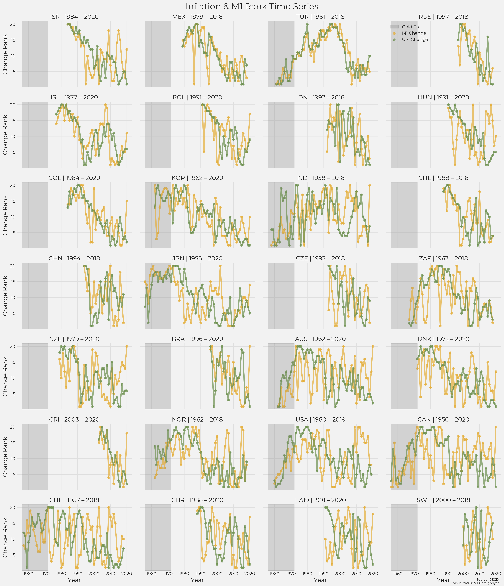
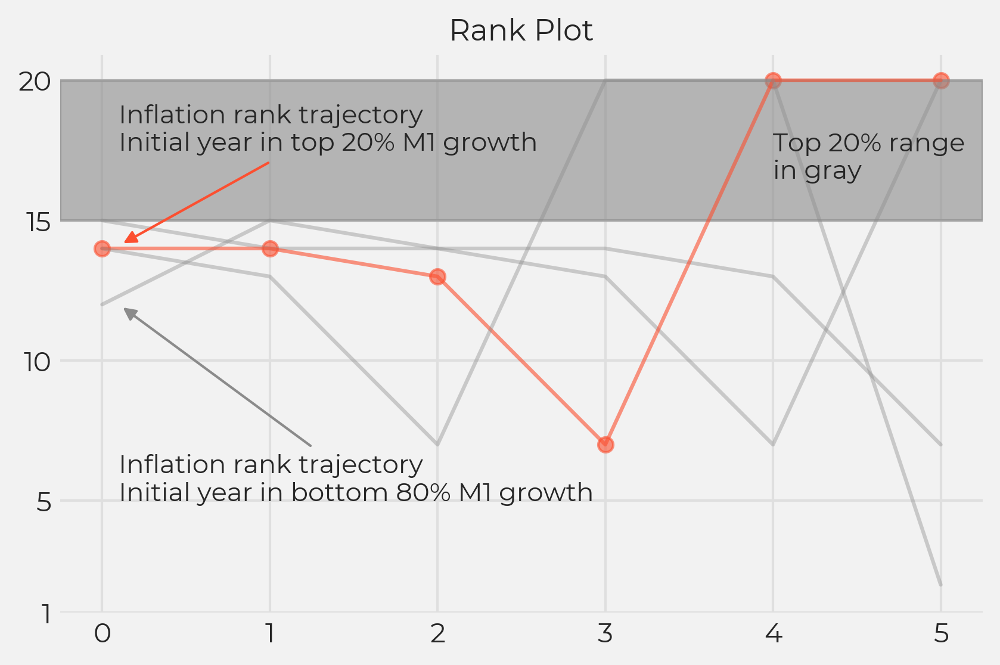
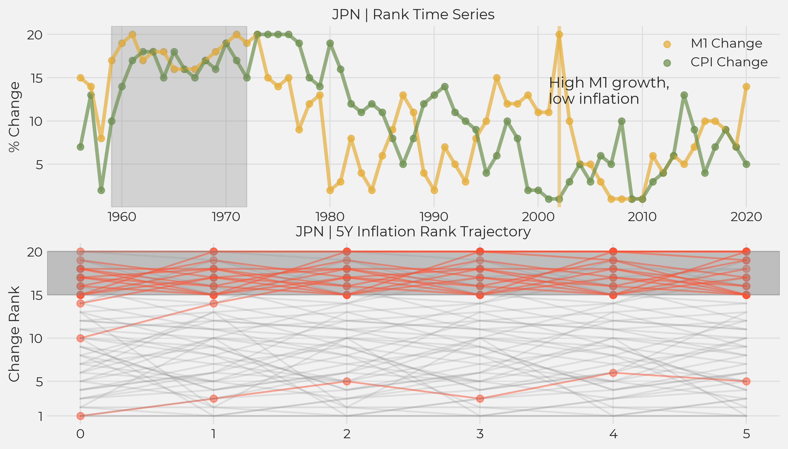
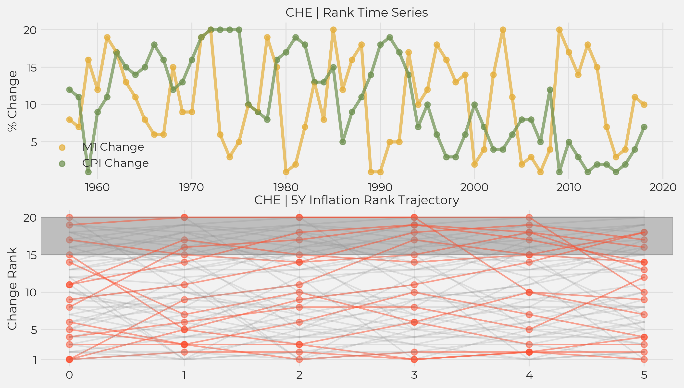

# The Quantity Theory of Money Insanity (Part 3)

*QTM as a predictor of inflation*

In the previous section, we looked at QTM as an explanation of hyperinflation. In the six cases of hyperinflation we examined in detail, only one of those cases was consistent with QTM.

In this section, we will look at a weaker form of QTM to see how well it explains inflation in the medium term.

## More Money, More Problems?

*With apologies to the late, great Notorious B.I.G.*

Scott Sumner [explains QTM](https://www.themoneyillusion.com/money-and-inflation-pt-3-the-quantity-theory-of-money-and-the-great-inflation/) as follows:

> One time changes in the supply of money cause a proportionate rise in the price level in the long run, as compared to where the price level would have been had the money supply not changed.

This is a weaker statement than "inflation is always and everywhere a monetary phenomenon," but, if accurate, it would still be helpful for understanding inflation. We will now proceed to taking a look at that question.

### Harmonizing time series

Recognizing if this statement is reflected in the data is difficult with the time-series plots above, but we can make a visualization where this phenomenon should stand out if true.

Instead of looking at year-over-year changes in percentage terms, we will look at them in terms of ranks. This will make it easier to compare data across countries and investigate general relationships between changes in the supply of money and the price level. 

We first group changes in the money supply and inflation each into quantiles of equal size. We will use 20 quantiles as a compromise between granularity and readability. This gives us a time series of ranks of changes in money supply (`c_m1`) and changes in CPI (`c_cpi`), an excerpt from which is shown below. In this excerpt, covering five years of data from Indonesia, the magnitude of the change in M1 between 1991 and 1992 is in the 5th of 20 quantiles, the change in CPI for the same period was in the 12th of 20 quantiles.

<table border="1" class="dataframe">
  <thead>
    <tr style="text-align: right;">
      <th></th>
      <th></th>
      <th>c_m1</th>
      <th>c_cpi</th>
    </tr>
    <tr>
      <th>LOCATION</th>
      <th>TIME</th>
      <th></th>
      <th></th>
    </tr>
  </thead>
  <tbody>
    <tr>
      <th rowspan="5" valign="top">IDN</th>
      <th>1992-01-01</th>
      <td>5</td>
      <td>12</td>
    </tr>
    <tr>
      <th>1993-01-01</th>
      <td>13</td>
      <td>15</td>
    </tr>
    <tr>
      <th>1994-01-01</th>
      <td>20</td>
      <td>14</td>
    </tr>
    <tr>
      <th>1995-01-01</th>
      <td>12</td>
      <td>14</td>
    </tr>
    <tr>
      <th>1996-01-01</th>
      <td>16</td>
      <td>13</td>
    </tr>
  </tbody>
</table>

When this is plotted, the movements of the changes in M1 and CPI are easier to follow.

    

    

### Change ranks (5 years forward)

Since it is acknowledged that changes in money supply need some time to affect inflation, we will use the table above to construct a five forward year series of inflation ranks for each year, categorized by changes in the money supply.

<table border="1" class="dataframe">
  <thead>
    <tr style="text-align: right;">
      <th></th>
      <th></th>
      <th></th>
      <th>Year_0</th>
      <th>Year_1</th>
      <th>Year_2</th>
      <th>Year_3</th>
      <th>Year_4</th>
      <th>Year_5</th>
    </tr>
    <tr>
      <th>LOCATION</th>
      <th>TIME</th>
      <th>cat</th>
      <th></th>
      <th></th>
      <th></th>
      <th></th>
      <th></th>
      <th></th>
    </tr>
  </thead>
  <tbody>
    <tr>
      <th rowspan="5" valign="top">IDN</th>
      <th>1992-01-01</th>
      <th>5</th>
      <td>12</td>
      <td>15</td>
      <td>14</td>
      <td>14</td>
      <td>13</td>
      <td>7</td>
    </tr>
    <tr>
      <th>1993-01-01</th>
      <th>13</th>
      <td>15</td>
      <td>14</td>
      <td>14</td>
      <td>13</td>
      <td>7</td>
      <td>20</td>
    </tr>
    <tr>
      <th>1994-01-01</th>
      <th>20</th>
      <td>14</td>
      <td>14</td>
      <td>13</td>
      <td>7</td>
      <td>20</td>
      <td>20</td>
    </tr>
    <tr>
      <th>1995-01-01</th>
      <th>12</th>
      <td>14</td>
      <td>13</td>
      <td>7</td>
      <td>20</td>
      <td>20</td>
      <td>2</td>
    </tr>
    <tr>
      <th>1996-01-01</th>
      <th>16</th>
      <td>13</td>
      <td>7</td>
      <td>20</td>
      <td>20</td>
      <td>2</td>
      <td>17</td>
    </tr>
  </tbody>
</table>

This give us a plot of the trajectory of how inflation ranks evolve over 6 years (the initial year, and 5 subsequent years). If M1 growth is in the top 20% in the first year, we draw the line in red; otherwise, the line is drawn in gray.

    

    

Applying this idea to all our data gives us this.

    

    

### Change Ranks in Detail

There is a lot to digest here. What we can say is, there are some countries for which Sumner's description of QTM seems to apply quite well, like Japan, and there are others for which it does not apply very well at all, like Switzerland.

### Japan

    

    

For Japan, high M1 growth has historically been a good predictor of high forward inflation. But on closer inspection, we see that most of the high M1 growth years were in the period 1959 &ndash; 1972, the Bretton-Woods era. More recent instances of high M1 growth, like 2002, were **not** followed by high inflation.

### Switzerland

And Switzerland presents a case where high M1 growth has not even historically been a good indicator of high forward inflation.

    

    

## Change Ranks of Inflation vs. Inflation

Let us make the same type of plot as in the previous section, but instead of using the rank of change in M1, we will use the rank of change in inflation to see how well that predicts future inflation.

    

    

For 20 of 28 currencies, if inflation is high in year 1, it has been high for 50% or more of the subsequent 5 years. Current inflation does a better job of predicting the level of future inflation than the change in the money supply does.

We can see focus on this by restricting our view to just those years where inflation is initially in the bottom 80%. If we plot inflation trajectories for these years (top 20% M1 growth in red), it becomes clear that the association between money-supply growth and future inflation is much stronger when inflation is already high. **If inflation is not already high, rapid M1 growth rarely leads to high inflation** in the following five years.

    

    

# Conclusions

In his 1970 Wincott Lecture, Milton Friedman said that “inflation is always and everywhere a monetary phenomenon in the sense that it is and can be produced only by a more rapid increase in the quantity.” Maybe this was true given the data he had at his disposal at that time. With the data available now, I think the 2021 version of that statement would be, **“Inflation might in some places and at certain times be a monetary phenomenon. :shrug-emoji:”**

There are theoretical reasons why QTM is plausible, but after looking at OECD data for almost 30 countries over a wide range of years, QTM, at least as it is explained to non-economists, is not borne out in the data. The Equation of Exchange, not QTM, explains the Barro data set; hyperinflation is sometimes, but by no means always, preceded by rapid growth of the money supply; and current inflation predicts the trajectory of inflation over the next 5 years better than the growth in the money supply does. In the real world, high inflation can occur before, after, or independently of increases in the money supply.

As important as the question of what causes inflation is the question of what to do about it. Take the case of Indonesia 1998 again. A regional neighbor devalues their currency, applying pressure on Indonesia to devalue and inflate. Indonesia reacted by giving in, devaluing and increasing the supply of the Rupiah. Would they have experienced better socio-economic outcomes had they not taken these steps? I would be interested to hear answers by monetarists and others.

These questions are not just academic and not just of interest to economists. Every day, new cryptocurrencies are being designed with the intention of replacing cash, and some of these cryptocurrencies have built-in assumptions about inflation and how to limit it. Eventually, cryptocurrencies will be exposed to pressures beyond their control, and a robust monetary design will be imperative to prevent things from going off the rails. 

In the episode of the [Odd Lots podcast on MMT with Stephanie Kelton](https://www.bloomberg.com/news/audio/2021-03-17/how-mmt-won-the-fiscal-policy-debate-podcast), much time is spent discussing inflation and its causes. Around minute 32, Tracy Alloway, asks Kelton to explain her views, and Kelton’s answer is basically, “It’s complicated.” In some ways this is less satisfactory than being able to point to variable X as the cause of inflation, but I think, in its favor, is that “it’s complicated” is a more accurate description of the world.
